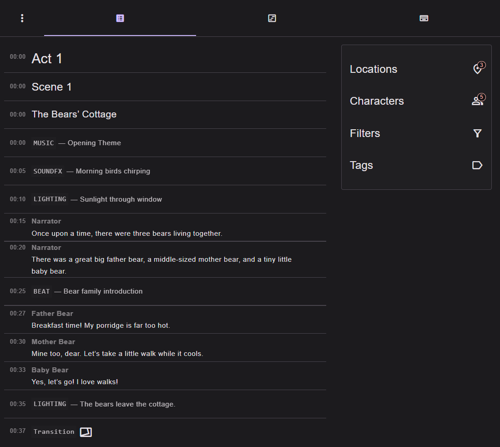
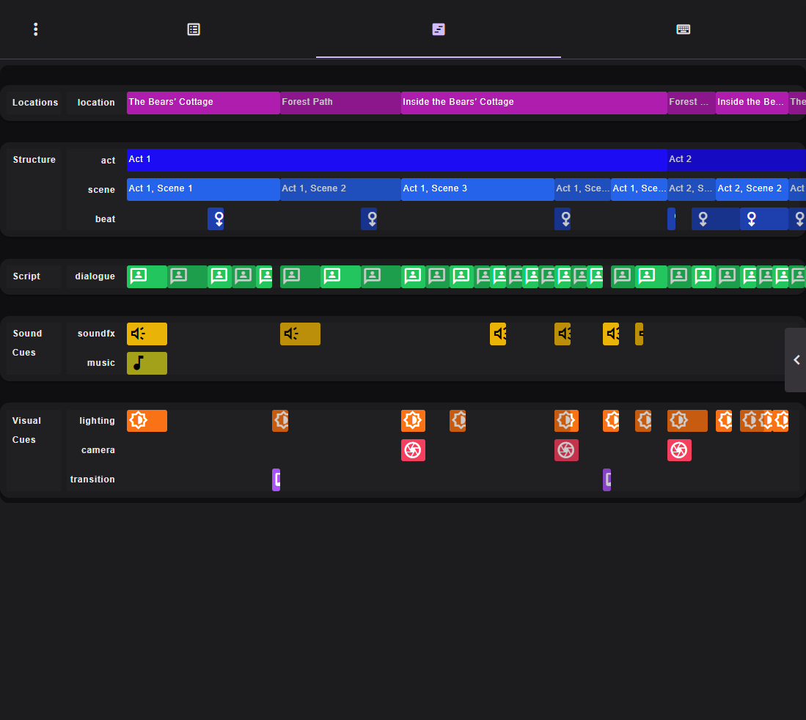
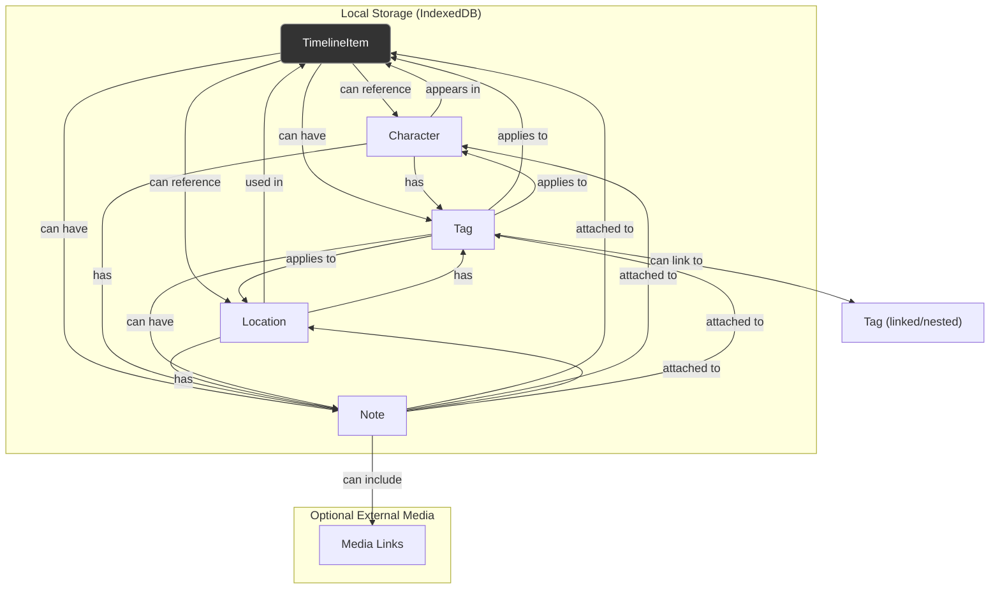
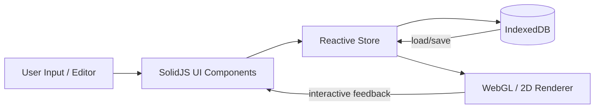
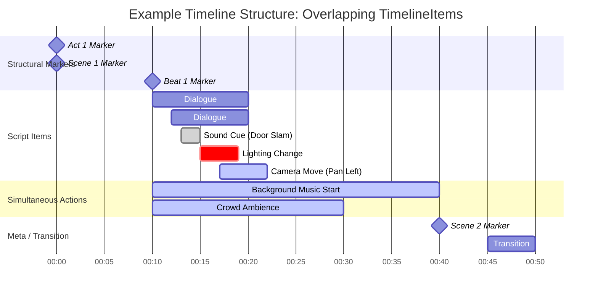

# Script Editor

[WIP](https://leegee.github.io/script-editor-linear/?1#/)

# Project Feature List:  Script Visualizer / Story Matrix

## Core Concepts

### Script Items

- A linear non-hierarchical data model
- **Single universal entity type** for anything appearing in the script or running order:

  - Dialogue, action, sound cue, lighting change, camera move, etc.
  - Meta items like **Act Marker**, **Scene Marker**, **Beat Marker**
- Script items can occur **sequentially or simultaneously**
- Can have:

  - **Duration** (explicit or computed)
  - **Tags** and **Notes**
  - Links to **Characters**, **Locations**, **Contacts**
- Subtypes and examples:

  - **Marker**:  Act / Scene / Beat (structural)
  - **Cue**:  Audio / Lighting / Transition
  - **Dialogue / Action**:  Character involvement
  - **Sound / FX / Score**: and more

  ---
- Each Timeline Item supports **three rendering/edit modes**:

  1. **Simplified View**:  minimal timeline blocks stacked as in traidtional scripts in vertical page format but with rich HTML controls and menus
  2. **Script View**:  traditional typewritten script page in standard industry format
  3. **Timeline**:  akin to timeline in a DAW, DVW, multi-track video or sound editor, showing blocks on content such as dialoge, lighting direction, audio cue reference or the cue itself, video, photos with timestamps and durations that (soon) can be played back in sequence, scrubbed through, and exported as mp3/4/etc.
- **Edits persist locally** (eg IndexedDB tables)
- Timeline items are linear, in timelineSequence() order - trees are more hassle than they are worth
- Items without a duration (like acts, scenes, beats) are “start markers” — their end is implicitly the start of the next item of the same type or the timeline’s end.
- Items with a duration (dialogue, action, etc.) have their start at the current time (now) and move now forward by their duration.

---

### Characters

- AKA Actors in scientific sense. Represent people or entities with roles in the script
- Have:
  - **Traits / Attributes** (key-value pairs, numeric sliders, categorical flags)
  - **Tags** and **Notes**
  - Optional **photo or avatar**
  - Links to **Timeline Items**, **Locations**, and **Contacts**
- **Full Detail / Editor View:**
  - Character card layout
  - Notes, traits, backstory, appearance
  - Optional visual media and reference links

---

### Locations

- Represent physical or conceptual places
- Have:
  - **Tags** and **Notes**
  - Links to **Timeline Items**, **Characters**, and **Contacts**
- **Full Detail / Editor View:**
  - Map editor or layout view
  - Hyper-linked shared contacts db with tags (eg liaison, owner)
  - Optional media (photos, documents, blueprints, moodboards) - various indefinite attachments supported
  - Scene/sequence references

---

### Tags

- **Universal linking system** for all entities
- Any entity (Timeline Item, Character, Location, Note) can have **multiple tags**
- Tags can represent:
  - **Themes** (eg *Hope*, *Isolation*, *Redemption*)
  - **Story Arcs**
  - **Character Arcs**
  - Or any conceptual grouping (*Mood*, *Motif*, *Symbolism*)
- **Default tag categories:**
  - `THEME`
  - `STORY ARC`
  - `CHARACTER ARC`
- Tags can:
  - Have **color codes**
  - Contain **Notes** and **Traits**
  - Be **nested** or **linked** (hierarchical or associative)
- **Themes and arcs are tag types, not entities**

---

### Notes

- **Attachable to anything** (Timeline Item, Character, Location, Tag)
- Can themselves be **tagged**
- Support:
  - **Rich text (Markdown or WYSIWYG)**
  - **Optional media links** (images, audio, video, documents)
  - **Nested or threaded** discussions
- Notes can appear as annotations in timelines or overlays

---

## UI Features

### Timeline / 3D Perspective View

- WebGL-based **skewed perspective timeline**
  - Shows chronological sequence stretching into distance
  - Smooth transitions between flat and 3D views
- Items appear as panels or nodes in perspective
- Can filter or dim by:
  - **Tag**
  - **Character**
  - **Location**
- Items with durations appear stretched; instantaneous items appear as points
- Supports **zoom / pan / rotate**
- Animation-ready CSS transforms for transitions

---

### Column / Matrix View

- Displays chronological **columns** of entities (timeline items, characters, etc.)
- Filters by **tag**, **character**, or **location**
- **Zoom / Focus Mode:**
  - Zoom enlarges selected column
  - Others shrink and dim
  - Further zoom blurs and darkens surrounding area (focus)
  - Controlled via:
    - Buttons
    - Mouse wheel + modifier key
    - Pinch gesture
- Columns color-coded by tag or arc
- Optional overlays for **story arc visualization**

---

## Data Model

- Every entity:
  - Has a **UUID**
  - Has timestamps / duration
  - Has **tags** and **notes**
  - Has **cross-links** (references to other entities)
- Entities are stored locally (IndexedDB or LocalStorage)
  - Example: `indexeddb.timelineItems`, `indexeddb.characters`, etc.
- Relationships are **bidirectional** for fast lookup
- Multiple simultaneous timelines supported (parallel actions)

---

## Future / Planned Features

- **Audio/video synchronization** for media-based timeline items
- **Timeline playback** (real-time simulation)
- **Collaboration** (multi-user, shared state)
- **Version history** and change diffing
- **Import/export** (Fountain, Final Draft, etc.)
- **AI-assisted tagging / trait inference**
- **Plugin system** for visualizations or integrations

---

## Technical Goals

- SolidJS + TypeScript reactive architecture
- IndexedDB-backed local persistence
- Modular data schemas (JSON-based storage)
- WebGL/Canvas hybrid renderer for perspective and timeline modes
- Accessibility and keyboard shortcuts
- Multi-touch and gesture support

---

---

## Entity Relationships Overview

---

## 🗂 Data Flow Overview

---

## Summary

- **TimelineItem** is the universal timeline entity
- **Character** and **Location** extend via references
- **Tag** and **Note** are shared, universal linkable layers
- **Storage** is local-first (IndexedDB), ready for sync extension
- **UI** and **Renderer** operate reactively from the same data graph

---

---

## Timeline Schema (Chronological + Simultaneous TimelineItems)

---

## Interpretation

- **Markers** (Act, Scene, Beat) are `TimelineItem` subtypes with **zero duration**
- **Dialogue**, **Action**, **Cue**, **Transition** are standard `TimelineItems` with duration
- **Simultaneous actions** (eg sound, music) run **in parallel** with others
- **Timeline** supports:
  - Explicit durations (`start + length`)
  - Implicit durations (computed or assigned)
  - Overlaps (multiple active items in same time range)

---

## To Do

- Implement timeline rendering using **WebGL / CSS transforms**
  - Animate zoom, skew, and focus transitions between:
  - Flat script list view
  - 3D perspective view

* Catch and throw more sooner with explicit bespoke error messages objects
* More logial restrictions to at least catch potential interface abuse: eg no char name can be a member of `Set(Set(timelineItemTypesForTyping))`
* Printer CSS
